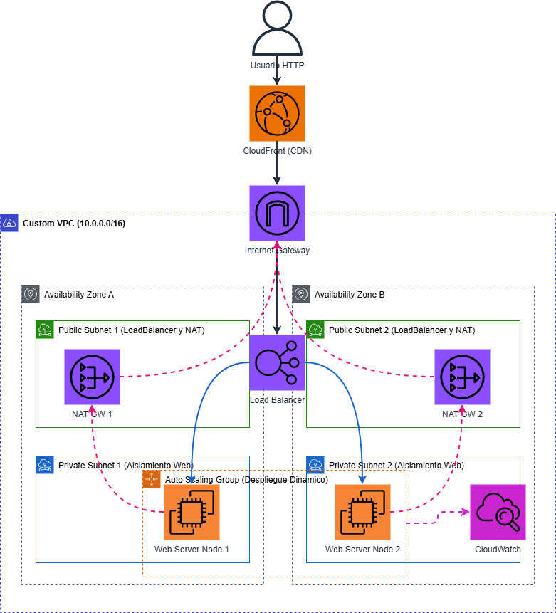

# Arquitectura Web en Alta Disponibilidad (AWS)

Repositorio del proyecto de despliegue de Infraestructura como Código (IaC) en AWS mediante **CloudFormation**, aprovisionando una topología de red segura, tolerante a fallos y altamente escalable.

## 1. Diagrama de Arquitectura

El siguiente esquema resume la arquitectura desplegada, aislando el cómputo del acceso exterior directo e implementando balanceo de carga en múltiples zonas de disponibilidad (AWS Multi-AZ/Dual-AZ).



## 2. Justificación de Diseño y Estrategia

La arquitectura se ha diseñado priorizando la **Seguridad, la Escabilidad y la Alta Disponibilidad** (AWS Well-Architected Framework), eligiendo servicios nativos administrados para minimizar la sobrecarga operativa:

*   **Custom VPC y Subredes (Aislamiento de Red):** Se optó por una VPC propia (`10.0.0.0/16`) dividida en capas (Pública y Privada). Esto permite segmentar el tráfico: el balanceador reside en la pública para recibir peticiones de Internet, mientras que las instancias EC2 se ocultan en subredes privadas, protegiéndolas de accesos directos maliciosos (sin IP pública).
*   **Application Load Balancer (ALB) Multi-AZ:** En un entorno de producción, un servidor individual es un punto único de fallo (SPOF). Se eligió un ALB desplegado en dos Zonas de Disponibilidad distintas porque distribuye inteligentemente el tráfico entrante. Si el "Centro de Datos A" de AWS sufre una interrupción, el ALB redirige inmediatamente todo el tráfico a las instancias sanas de la "Zona B", logrando **Alta Disponibilidad**.
*   **Auto Scaling Group (ASG):** Las cargas de tráfico web son impredecibles. El ASG soluciona esto garantizando dinámicamente el rendimiento: mantiene siempre un mínimo de 2 instancias sanas y, si el consumo de CPU global supera el 50%, lanza nuevos servidores automáticamente (*Target Tracking Scaling*). Esto asegura adaptabilidad elástica sin intervención manual.
*   **NAT Gateways:** Dado que las EC2 están en subredes privadas, no tienen salida a Internet por defecto. Se incluyeron NAT Gateways en las subredes públicas para permitir que estas instancias privadas descarguen e instalen las dependencias (el servidor Apache `httpd` vía Bootstrap) de forma segura y unidireccional, sin exponerlas a conexiones de entrada.
*   **CloudFront (CDN):** Para optimizar la latencia global y reducir la carga directa sobre el ALB y los servidores web, se integró una distribución de CloudFront. Esta estrategia cachea el contenido estático en los "Edge Locations" de AWS más cercanos al usuario final, mejorando radicalmente los tiempos de respuesta.
*   **CloudWatch y SNS (Observabilidad):** Es imperativo monitorizar los sistemas escalables. Se escogió CloudWatch para generar un Dashboard unificado que visualiza el tráfico HTTP y el consumo de CPU. SNS se acopló al Auto Scaling para enviar alertas inmediatas cuando la infraestructura reaccione aumentando o disminuyendo máquinas.

## 3. Despliegue y Configuración

El proyecto es **autocontenido**: aprovisiona toda la arquitectura de red desde cero mediante variables parametrizables en código.

### Requisitos Previos
1. [AWS CLI](https://aws.amazon.com/cli/) instalado localmente.
2. Cuenta autenticada en AWS (vía `aws configure` o credenciales del Learner Lab).
3. Consola PowerShell.

### Instrucciones de Despliegue
1. (Opcional) Abre el archivo `launch-infra.ps1` y modifica el parámetro `AdminEmail="luis.simon@alumni.immune.institute"` por un correo de tu elección para recibir alertas en tiempo real de escalado.
2. Ejecuta el script de orquestación desde la raíz:
   ```powershell
   .\launch-infra.ps1
   ```
3. El despliegue de toda la topología de red y CloudFront tardará en desplegarse unos minutos.
4. Para ver el progreso del despliegue:
   ```powershell
   .\progreso-deployment.ps1
   ```
5. Cuando lances el script anterior y este este en estado 'CREATE_COMPLETE', aparte mostrará las urls del Load Balancer y de CloudFront. Accede a ellas y verifica que el despliegue se ha realizado correctamente.